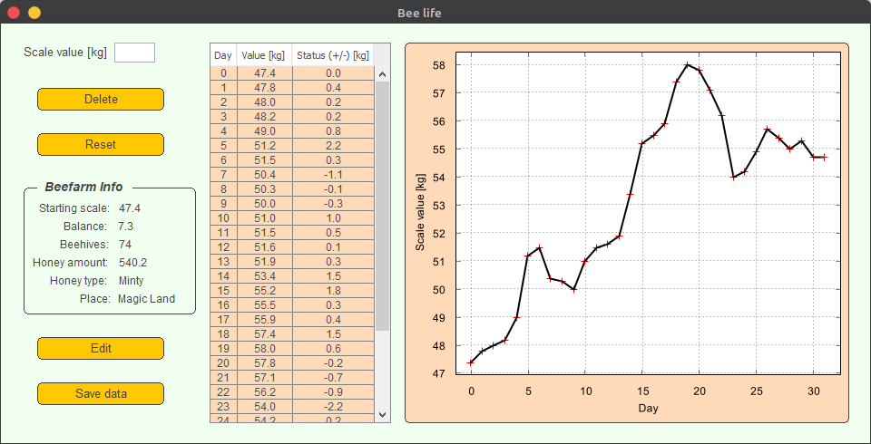

# Bee Life
A desktop tool used to monitor beekeeping scale in the apiary.

# Key features
- Track scale value
- Data visualisation as a 2D Chart
- The ability to add more info about bee farm, such as the number of beehives, honey type, bee farm's place, etc.
- The ability to export data:
  1. Scale values as an Excel/CSV file
  2. Scale values chart in the .png format

# GUI

# Building the Application
+ download the source code `git clone https://github.com/soundwalk/Bee-Life.git`
+ go to the main folder `cd ./Bee-Life/`
+ build the App `./gradlew installDist`
+ run the App via `java -jar ./build/libs/Bee-Life-1.0-all.jar`

# Running the Application directly from the build
+ download the source code `git clone https://github.com/soundwalk/Bee-Life.git`
+ go to the main folder `cd ./Bee-Life/`
+ run the App via `./gradlew run`
